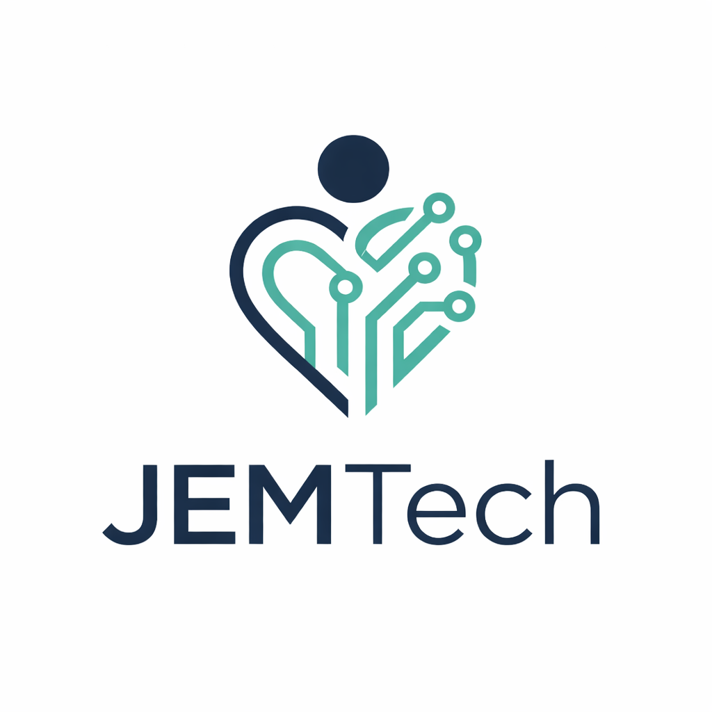

# 🚀 CEIControl

  
  &nbsp;&nbsp;&nbsp;&nbsp;&nbsp;
  

  <b>Sistema de Gestão para Centros de Educação Infantil Públicos</b>

  
  
  
  
  
  

---

## 👨‍💻 Equipe e Orientação

<table align="center">
  <tr>
    <td align="center">
      <a href="https://github.com/EduardoMartins-tech">
         
        <b>Eduardo Ferreira Martins</b> 
      </a>
    </td>
    <td align="center">
      <a href="https://github.com/JVCod1ng">
         
        <b>João Vitor Martins</b> 
      </a>
    </td>
  </tr>
</table>

### 👨‍🏫 Orientação
* **Prof. Jefferson Roberto de Lima**  — *Disciplina de Projeto Integrador III.*
* **Prof. Francisco Douglas Lima Abreu** — *Disciplina de Projeto Integrador II & Programação WEB.*

## 🏢 A Empresa: JEM Tech

A **JEM Tech** é uma startup de impacto social focada no desenvolvimento de soluções digitais de gestão exclusivas para democratizar o acesso à tecnologia.

* **Missão:** Democratizar o acesso à tecnologia de gestão, fornecendo plataformas gratuitas e robustas para a gestão pública.
* **Visão:** Ser a principal referência nacional em sistemas de gestão pública, ampliando a digitalização da base do país.
* **Valores:** Inovação para simplificar rotinas, segurança e criptografia de dados sensíveis, acessibilidade em plataformas gratuitas e intuitivas, e respeito ao meio ambiente através da redução do uso de papel.

## 🌍 Alinhamento com os Objetivos de Desenvolvimento Sustentável (ODS)

O CEIControl não é apenas uma ferramenta técnica, mas também uma iniciativa de impacto social alinhada com as metas globais da ONU para promover uma educação inclusiva e de qualidade:

* **ODS 4 – Educação de Qualidade:** Melhora a infraestrutura de comunicação e a gestão das creches públicas.
* **ODS 9 – Indústria, Inovação e Infraestrutura:** Promove a modernização e digitalização de processos governamentais legados.
* **ODS 10 – Redução das Desigualdades:** Oferece uma solução robusta e 100% gratuita para reduzir a exclusão digital no ambiente escolar público.
* **ODS 17 – Parcerias e Meios de Implementação:** Viabiliza a integração entre prefeituras, secretarias de educação e a comunidade escolar.
